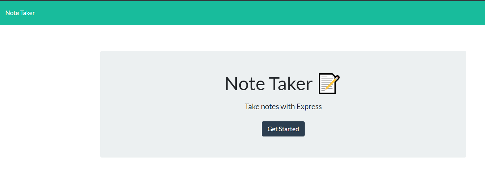
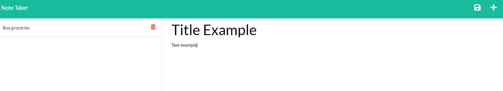
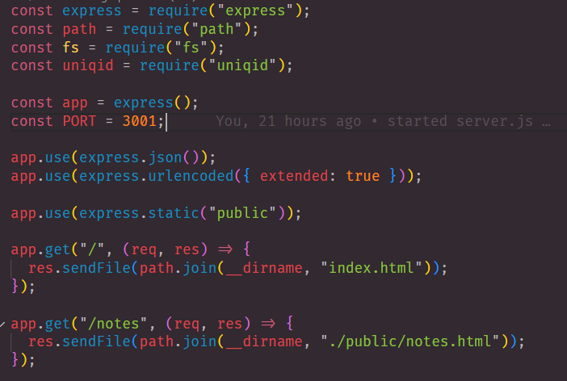
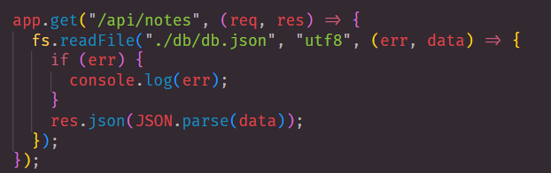
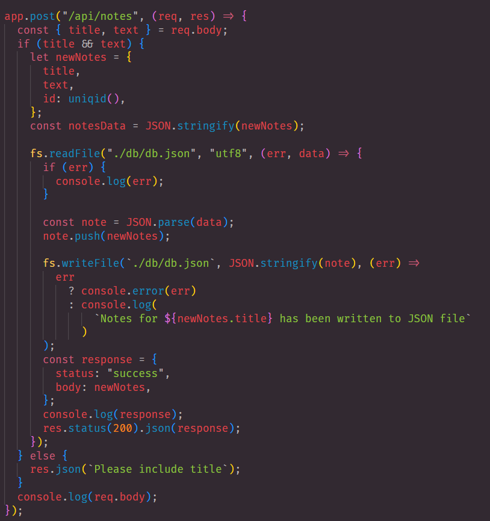
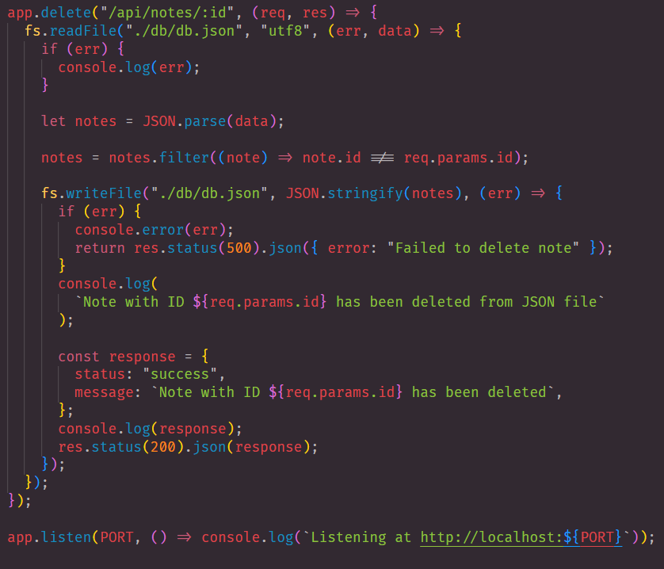
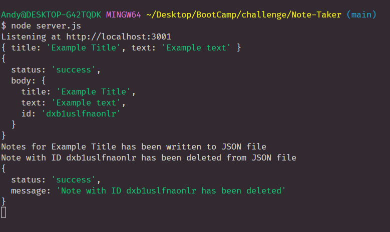

# Note Taker
By: thandyn

## Description
This project was mainly working on writing the backend code for an already developed front end 

## Table of Content 
  - [Installation](#installation)
  - [Usage](#usage)
  - [Questions](#questions)
  - [License](#license)
  - [Contribute](#contribute)
  - [Test](#test)

## Installation
Type in "npm i" in the terminal to install server and uniqid npm

## Usage

This is the home page of the application. Click on get started to start taking notes

This is the note page of the application. Users can input their note title and text into the body. With the disk icon on the top right, it lets you save your notes. The plus icon lets you start a new note. The trash can icon next to the saved notes will delete your note 

This is just the basic for making a server. There were two HTML pages I had to link to the server. 

The first part of this back end project was making the get method to read the database. 

Then I got started with the post method. This allows users to have everything they wrote into the database. First we read the files, then we pushed the data to the database and wrote the files to the database. We made a response to end the request. 

This step was almost similar to our post method. Instead of pushing in the data, we used the filter method. Then we write file to rewrite what we want deleted. 

These are all the responses that are being relayed back to us from the application to the server. 

## License
None

## Contribute
I worked on this project with my classmate, Dyllan. If you want to contribute, feel free to contact me how you would like to contribute. 

## Test
To run test, go to terminal and type in "node server.js", then go on to your browser and go to HTTT://localhost:3001. 

## Questions
If you have any questions, please email me at: nguyenphuthan@gmail.com. 
For more information, please visit my Github link: https://github.com/thandyn/.

## Links 

Github link to project : https://github.com/thandyn/Note-Taker

Due to Heroku not being available to us. We could not deploy the application. Therefore there is no link to application. 
